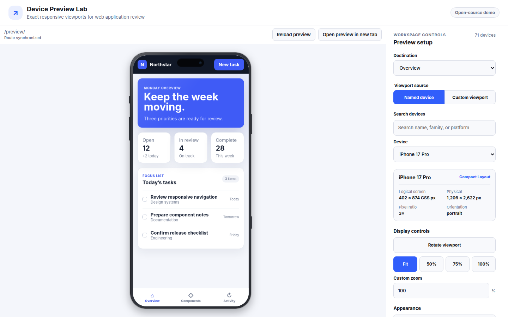
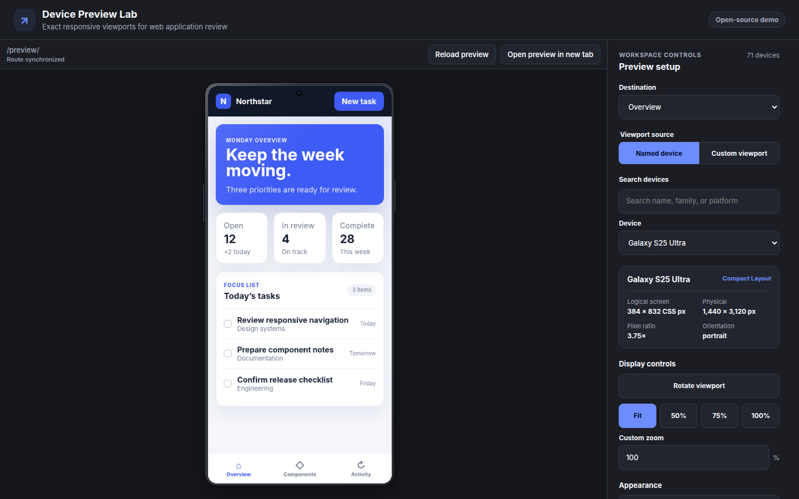
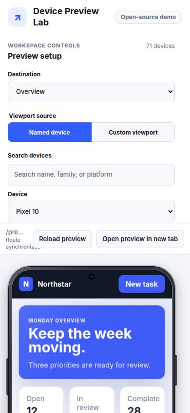

# React Device Lab

`react-device-lab` is an open-source React toolkit for reviewing responsive web
applications in exact, named CSS viewports. It combines an iframe-backed preview
engine, 71 device profiles, independent authored frames, a searchable catalog,
orientation and display scaling, route tools, safe-area visualization, and
configurable browser-environment scenarios.

It is a responsive application preview tool, not an iOS, Android, browser-engine,
or hardware emulator. Use it to catch layout and interaction problems early;
verify OS-owned behavior on real devices and platform tooling.



<details>
<summary>Dark and narrow workspace screenshots</summary>





</details>

## Features

- Exact iframe viewport dimensions with portrait and landscape orientation.
- Fit, 50%, 75%, 100%, and custom visual scale without changing media-query
  dimensions.
- 71 phones, foldables, tablets, laptops, desktops, and ultrawide profiles.
- Independently authored CSS/React skins with notches, camera cutouts, buttons,
  fold creases, laptop bases, and monitor stands.
- Same-origin SPA route inspection and an exact-origin `postMessage` bridge for
  cooperating cross-origin applications.
- Searchable/grouped device selection, custom viewports, destinations, reload,
  and open-in-new-tab actions.
- Full-screen desktop workspace with independent stage/panel scrolling and a
  responsive narrow layout.
- Light/dark themes and product-neutral `--rdl-*` CSS custom properties.
- Optional safe-area, virtual-keyboard, locale, direction, text-scale,
  accessibility, pointer, fold, and permission scenarios.
- SSR-safe ESM imports, TypeScript declarations, and React 18/19 peer support.

## Installation

```bash
npm install react-device-lab
```

Import the stylesheet once in the application that hosts the lab.

```tsx
import { DevicePreviewLab } from "react-device-lab";
import "react-device-lab/styles.css";

export function PreviewRoute() {
  return (
    <DevicePreviewLab
      src="http://localhost:3000"
    />
  );
}
```

The target URL must permit framing. For production targets, configure a narrow
Content Security Policy `frame-ancestors` allow-list and review the
[iframe security guide](docs/security.md).

## Destinations and controlled state

```tsx
import {
  DevicePreviewLab,
  type PreviewRouteState,
} from "react-device-lab";
import "react-device-lab/styles.css";

const destinations = [
  { id: "home", label: "Home", src: "http://localhost:3000/" },
  { id: "settings", label: "Settings", src: "http://localhost:3000/settings" },
];

export function ReviewWorkspace() {
  const handleRoute = (route: PreviewRouteState) => {
    console.info("Embedded route:", route.pathname);
  };

  return (
    <DevicePreviewLab
      defaultDeviceId="iphone-17-pro"
      destinations={destinations}
      onRouteChange={handleRoute}
      src={destinations[0].src}
      title="Responsive review"
    />
  );
}
```

The embedded application remains authoritative for live SPA navigation.
`onRouteChange` observes normalized same-origin or bridge route state without
remounting the iframe. Use `src` or `destinations` for top-level navigation.

## Rendering React content

Pass React children instead of `src` to render through an iframe portal. CSS
media queries then use the iframe viewport, unlike a host-width `<div>`.

```tsx
<DevicePreviewLab
  defaultDeviceId="pixel-10"
  portalStyles="body { margin: 0; font-family: system-ui; }"
>
  <YourResponsiveApplication />
</DevicePreviewLab>
```

Portal component closures still run in the host JavaScript realm. Read
[iframe modes and fidelity](docs/iframe-and-bridge.md) before choosing this mode.

## Documentation

- [Public API and custom devices](docs/api.md)
- [Iframe modes, routes, and bridge](docs/iframe-and-bridge.md)
- [Environment scenarios and native limitations](docs/environment-scenarios.md)
- [Theme customization](docs/theming.md)
- [Accessibility](docs/accessibility.md)
- [Vite, Next.js, and SSR integration](docs/frameworks.md)
- [Browser support](docs/browser-support.md)
- [Iframe security](docs/security.md) and [security policy](SECURITY.md)
- [Device data and update policy](docs/device-data.md)
- [Device skins and visual fidelity](docs/device-frames.md)
- [Release process](docs/releasing.md)
- [Contributing](CONTRIBUTING.md), [changelog](CHANGELOG.md), and
  [MIT license](LICENSE)

## Acknowledgement

[Flutter Device Preview](https://github.com/aloisdeniel/flutter_device_preview)
demonstrated how valuable an integrated device-preview workflow can be and
inspired the interaction category. This repository is an independent React/web
implementation: it does not copy that project’s code, data, or assets.

## Status

The project is preparing its first public release. No package publication is
performed by ordinary CI, and a maintainer must explicitly publish a matching
GitHub Release before the trusted-publishing workflow can run.
